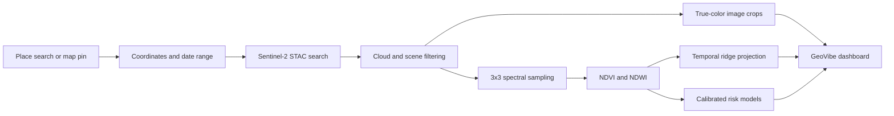

<div align="center">

# GeoVibe AI

### Global satellite intelligence for vegetation and surface-water change

GeoVibe AI turns live Copernicus Sentinel-2 observations into location-specific imagery, NDVI and NDWI signals, six-month environmental trajectories, and calibrated flood/drought susceptibility indicators.

[](https://nodejs.org/)
[](https://sentinels.copernicus.eu/)
[](#global-area-selection)
[](#quick-start)
[](#testing)

</div>

## Table of contents

- [Overview](#overview)
- [Features](#features)
- [How it works](#how-it-works)
- [Quick start](#quick-start)
- [Using the dashboard](#using-the-dashboard)
- [Machine-learning design](#machine-learning-design)
- [API reference](#api-reference)
- [Project structure](#project-structure)
- [Testing](#testing)
- [Limitations](#limitations)
- [Troubleshooting](#troubleshooting)
- [Contributors](#contributors)

## Overview

GeoVibe AI is a full-stack environmental monitoring prototype built with Node.js and browser-native JavaScript. A user can search anywhere in the world, position a draggable map pin, select baseline and comparison dates, and run an analysis against real satellite acquisitions.

The dashboard compares cloud-filtered imagery, calculates vegetation and surface-water indices, projects their trajectories for six calendar months, and presents flood and drought susceptibility signals. It requires no API key and has no third-party runtime package dependencies.

## Features

| Capability | What it provides |
| --- | --- |
| Global area selection | Worldwide place search, coordinate input, map clicks, and a draggable pin |
| Satellite comparison | True-color baseline and comparison crops from selected Sentinel-2 acquisitions |
| Spectral indices | NDVI for vegetation condition and NDWI for surface-water response |
| Spatial sampling | Scene-filtered 3x3 sampling grid with median aggregation |
| Temporal analysis | Twelve observations distributed across the selected date range |
| Trajectory explorer | Combined or individual NDVI/NDWI views with zooming and drag-to-pan navigation |
| Six-month projection | Timestamp-aware ridge trend with prediction intervals |
| Susceptibility outlook | Separately calibrated flood and drought indicators |
| Analysis coverage | Percentage of expected spatial samples successfully returned |
| Responsive interface | Presentation-focused, single-screen dashboard for desktop and mobile layouts |

## How it works



Data is requested from the Microsoft Planetary Computer STAC and data APIs. Location search is provided by OpenStreetMap Nominatim. Successful analysis responses are cached in memory for 30 minutes, while geocoding results are cached for 24 hours.

## Quick start

### Requirements

- Node.js 20 or newer
- An active internet connection
- A modern browser with JavaScript enabled

### Run locally

After cloning or downloading the repository:

```bash
cd geovibe-ai
npm start
```

Open [http://127.0.0.1:8501](http://127.0.0.1:8501) in a browser.

No `npm install` step is required because the application uses Node.js built-in modules and browser-native libraries loaded by the page.

To use a different port:

```powershell
$env:PORT = 8600
npm start
```

The server must remain running while the dashboard is in use. Closing its terminal or stopping the Node process will leave the browser page visible but disable location search and satellite analysis.

## Using the dashboard

### Global area selection

1. Type at least three characters in **Area of Interest** and select a suggestion.
2. Alternatively, enter a latitude/longitude pair, click the map, or drag the pin.
3. Fine-tune the location using the map zoom controls.

### Date selection

1. Choose a baseline date and a later comparison date.
2. Use a focused span of approximately 3 to 36 months for the clearest interpretation.
3. Keep comparison dates in the past. Future values are shown only by the trajectory projection.
4. Allow up to 40 days around each requested date for a suitable cloud-filtered acquisition.
5. If no capture is available, move the requested date by one or two months and try again.

### Reading the output

- **Satellite comparison:** real acquisitions selected nearest to each requested date.
- **NDVI:** vegetation greenness and vigor, normalized from `-1` to `1`.
- **NDWI:** surface-water and moisture response, normalized from `-1` to `1`.
- **Solid trajectory lines:** observed Sentinel-2 measurements.
- **Dashed trajectory lines:** six-month model projections.
- **Shaded bands:** 95% prediction intervals, not guaranteed outcome ranges.
- **Susceptibility signals:** model-based indicators, not probabilities of a disaster event.
- **Analysis coverage:** completeness of the expected sampling grid, not model confidence.

## Machine-learning design

### Runtime analysis

- Sentinel-2 bands B03, B04, B08, and the Scene Classification Layer are sampled around the selected point.
- Invalid, cloud-affected, and unsuitable scene classes are excluded.
- NDVI and NDWI are calculated for each valid grid sample and aggregated using the median.
- Time-series features capture level, change, recent slope, and volatility.
- Flood and drought models use binary logistic regression followed by Platt calibration on a separate partition.
- Six future calendar months are estimated with timestamp-aware ridge regression.
- Annual seasonality is enabled only when the available history spans enough time to support it.
- Prediction intervals include observation noise and fitted-parameter uncertainty.

### Included classifier artifact

The repository also includes a reproducible Random Forest spectral classifier with four proxy classes:

- Dense Vegetation
- Moderate Vegetation
- Sparse Vegetation
- Surface Water

It is trained using bootstrapped trees and Gini-impurity splits, then evaluated on deterministic, disjoint training, calibration, and test partitions. The current dashboard does not display land-cover classification; the artifact and tests remain available for experimentation and extension.

### Training data statement

The bundled Random Forest and risk-model datasets use reproducible proxy spectral/environmental scenarios. Runtime index measurements and imagery come from real Sentinel-2 acquisitions, but the learned models have not been operationally validated against regionally representative field labels or historical disaster outcomes.

## Training

Regenerate both model artifacts:

```bash
npm run train
```

This writes:

```text
model/land-cover-forest.json
model/risk-models.json
```

Runtime retraining is intentionally disabled in the browser. Training is an explicit local operation so presentation traffic cannot alter model state.

## API reference

| Method | Endpoint | Purpose |
| --- | --- | --- |
| `GET` | `/api/geocode?q={query}` | Search worldwide locations |
| `GET` | `/api/overview` | Return supported indices, coverage, selection modes, and model metadata |
| `POST` | `/api/analyze` | Run imagery, spectral, trajectory, coverage, and susceptibility analysis |
| `GET` | `/api/satellite-image` | Proxy the selected true-color Sentinel-2 image crop |

Example analysis request:

```json
{
  "beforeDate": "2024-03-15",
  "afterDate": "2026-03-15",
  "location": "New Delhi, India",
  "coordinates": {
    "lat": 28.6139,
    "lon": 77.2090
  }
}
```

Example with `curl`:

```bash
curl -X POST http://127.0.0.1:8501/api/analyze \
  -H "Content-Type: application/json" \
  -d '{"beforeDate":"2024-03-15","afterDate":"2026-03-15","location":"New Delhi, India","coordinates":{"lat":28.6139,"lon":77.2090}}'
```

## Project structure

```text
geovibe-ai/
|-- model/
|   |-- land-cover-forest.json   # Serialized Random Forest artifact
|   `-- risk-models.json         # Calibrated flood/drought models
|-- public/
|   |-- assets/
|   |   `-- earth-orbit-hero.png # Dashboard background artwork
|   |-- app.js                   # Map, analysis, chart, and UI behavior
|   |-- index.html               # Dashboard structure
|   `-- styles.css               # Responsive dashboard visual system
|-- scripts/
|   |-- train.js                 # Random Forest training pipeline
|   `-- train-risk.js            # Risk-model training pipeline
|-- src/
|   |-- ml.js                    # Random Forest and confidence calibration
|   |-- risk.js                  # Risk features, fitting, and calibration
|   `-- timeseries.js            # Timestamp-aware forecasting
|-- test/
|   |-- ml.test.js               # Classifier and calibration tests
|   |-- risk.test.js             # Risk-model and feature tests
|   |-- server.test.js           # API and capture-selection tests
|   `-- timeseries.test.js       # Forecasting and seasonality tests
|-- .gitignore
|-- server.js                    # Static server and analysis API
|-- package.json
`-- README.md
```

## Testing

Run the complete test suite:

```bash
npm test
```

The tests cover:

- Random Forest holdout quality and expected class behavior
- Empirical confidence calibration
- Differentiated and bounded risk outputs
- Irregular temporal spacing and forecasting uncertainty
- Capture selection and 40-day tolerance enforcement
- Future-date and browser-retraining rejection
- Seasonal-model activation safeguards

## Limitations

- GeoVibe AI is an academic prototype, not an emergency-warning system.
- Flood and drought outputs are susceptibility indicators, not event probabilities.
- Satellite availability depends on location, acquisition history, cloud conditions, and upstream services.
- A point-centered sampling grid cannot represent every condition across a large administrative region.
- The six-month trajectory is an index projection, not a weather or climate forecast.
- Scientific deployment requires regional ground truth, spatial and temporal holdouts, historical outcome labels, bias assessment, and independent external validation.

## Troubleshooting

### Site cannot be reached

The local Node.js server is not running. Start it from the project directory and keep the terminal open:

```bash
npm start
```

### Location search is unavailable

- Confirm the local server is running.
- Confirm internet access is available.
- Type at least three characters and wait briefly for the rate-limited Nominatim request.
- Try a broader place name or paste coordinates.

### Satellite data is unavailable

- Confirm the selected comparison date is not in the future.
- Keep both dates within Sentinel-2's operating era (2015 onward).
- Shift either date by one or two months if no valid acquisition exists within 40 days.
- Try a nearby point if the selected coordinate lies outside usable coverage or over persistent cloud.
- Check whether Microsoft Planetary Computer is reachable from the current network.

### Analysis appears slow

A new location/date combination can require catalog search, twelve temporal observations, multiple spatial samples, and two image requests. Repeated requests are faster while the in-memory cache remains active.

## Data sources

- [Copernicus Sentinel-2](https://sentinels.copernicus.eu/) for multispectral Earth-observation data
- [Microsoft Planetary Computer](https://planetarycomputer.microsoft.com/) for STAC search, spectral sampling, and image rendering
- [OpenStreetMap Nominatim](https://nominatim.org/) for worldwide geocoding
- [Leaflet](https://leafletjs.com/) and [OpenStreetMap](https://www.openstreetmap.org/) for interactive mapping

## Contributors

- [Aditya Kundliya](https://www.linkedin.com/in/aditya-kundliya-3ba57b371/)
- [Himanshi Saxena](https://www.linkedin.com/in/himanshi-saxena-671651380/)
- [Prashant Mishra](https://www.linkedin.com/in/prashant-mishra-53951037b/)
- [Shweta Prasad](https://www.linkedin.com/in/shweta-prasad-961509378/)
- [Bharat Akhand](https://www.linkedin.com/in/bharatakhand/)
- [Shraddha Ashish Gulve](https://www.linkedin.com/in/shraddha-gulve-3458a32b1/)

